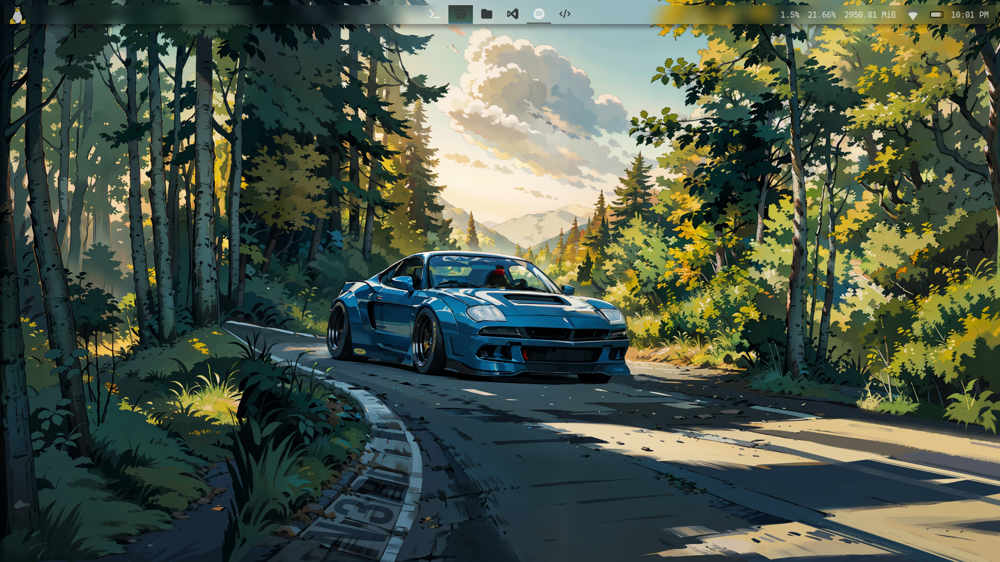
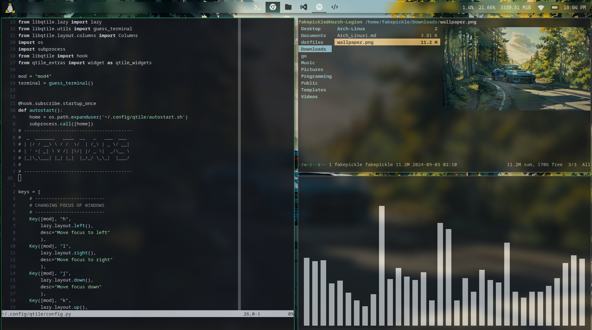

## Qtile Dotfiles

These are my personalized configurations for the Qtile window manager.
The repository includes both automatic and manual installation methods.
It will come with configurations for tools like neovim, dunst, picom,
and rofi.

## Table of Contents
* [Installation](#installation)
	* [Manual Installation](#manual)
	* [Automatic Installation](#automatic)
* [Dependencies](#deps)
* [Screenshots](#screenshots)
* [Customization](#customs)
* [Contributing](#contributions)
* [LICENSE](#license)

### Installation <a name="installation"></a>
##### Manual Installation <a name="manual"></a>

1. Clone the repository
```
git clone https://github.com/FakePickle/dotfiles.git
cd dotfiles
```
2. Copy the configuration files to their respective folders
```
cp -r Configs/nvim ~/.config/nvim/
cp -r Configs/dunst ~/.config/dunst/
cp -r Configs/picom ~/.config/picom/
cp -r Configs/qtile ~/.config/qtile/
cp -r Configs/rofi ~/.config/rofi/
cp -r Configs/tmux ~/.config/tmux
```
3. Install the necessary packages (listed in the [Dependencies](#deps) Section)

##### Automatic Install <a name="automatic"></a>

1. Clone the repository
```
git clone https://github.com/FakePickle/dotfiles.git
cd dotfiles
```
2. Run the installation script
```
sudo chmod +x automatic_install.sh
./automatic_install.sh
```

### Dependencies <a name="deps"></a>

Make sure to install the following packages before using the dotfiles:
* Neovim
* Dunst
* Picom
* Rofi
* Nitrogen
* Betterlockscreen
* Playerctl
* ttf-cascadia-code-nerd
* python-iwlib
* python-psutil
* qtile-extras
* upower
* tmux

You can install the packages using the following command:-
```
sudo pacman -S python-iwlib python-psutil dunst picom neovim rofi nitrogen betterlockscreen playerctl tmux
yay -S qtile-extras ttf-cascadia-code-nerd upower
```
### Screenshots <a name="screenshots"></a>

Desktop Setup


Neovim Setup:


Dunst Volume and Brightness:


### Customization <a name="customize"></a>
Feel free to customize the configurations to match your own workflow and preferences. All configurations are modular and can be easily adapted.

### Contributing <a name="contributions"></a>
Contributions are welcome! If you find any issues or have suggestions for improvement, feel free to submit a pull request or open an issue.

### License <a name="license"></a>
This project is licensed under the MIT License. See the LICENSE file for details.
